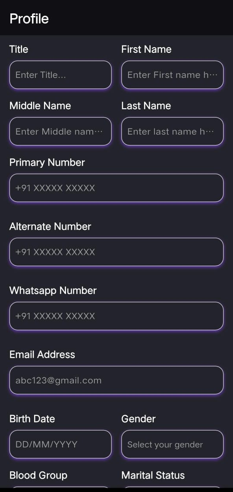

# dynamic_json_form_builder

[](https://pub.dev/packages/dynamic_json_form_builder)
[](https://pub.dev/packages/dynamic_json_form_builder/score)
[](https://pub.dev/packages/dynamic_json_form_builder/score)
[](https://pub.dev/packages/dynamic_json_form_builder)

---

## Overview

**dynamic_json_form_builder** is a highly advanced, reusable, and extensible JSON-driven form builder for Flutter. Effortlessly build dynamic, beautiful, and responsive forms from JSON with support for all major field types, custom theming, validation (sync/async), conditional logic, and user-defined custom fields. Perfect for app developers who want to create flexible forms without writing repetitive UI code.

---

## Features

- 📝 **All major field types**: text, dropdown, date, checkbox, radio, multi-select, file upload, and more
- 🎨 **Custom theming**: Light, dark, and fully custom themes
- ✅ **Validation**: Synchronous and asynchronous validation
- 🔄 **Conditional logic**: Show/hide fields based on other values
- 🧩 **Custom fields**: Plug in your own field widgets
- 📱 **Responsive**: Adapts to all screen sizes (MediaQuery, AutoSizeText)
- 💬 **Placeholder/hint support**: For all field types
- 🏷️ **Label placement**: Above or beside fields
- 🗂️ **Section/group support**: Organize fields in rows or columns
- 🛠️ **Extensible**: Easily add new field types or behaviors
- 🖥️ **Platform support**: Android, iOS, Web, Windows, macOS, Linux

---

## Installation

Add to your `pubspec.yaml`:

```yaml
dependencies:
  dynamic_json_form_builder: ^1.0.0
```

Then run:

```sh
flutter pub get
```

---

## Usage Example

```dart
import 'package:dynamic_json_form_builder/dynamic_json_form_builder.dart';

final fields = [
  {
    "key": "email",
    "type": "email",
    "label": "Email",
    "placeholder": "Enter your email",
    "required": true,
  },
  {
    "key": "gender",
    "type": "dropdown",
    "label": "Gender",
    "options": ["Male", "Female", "Other"],
    "placeholder": "Select your gender",
  },
  // ... more fields ...
];

class MyFormPage extends StatelessWidget {
  @override
  Widget build(BuildContext context) {
    return JsonFormBuilder(
      config: {"fields": fields},
      onChanged: (data) => print(data),
      // theme: FormTheme(...), // Optional: custom theming
    );
  }
}
```

---

## API Reference

### Key Widgets & Classes

- **JsonFormBuilder**  
  The main widget. Takes a JSON config and builds the form.

- **FormTheme**  
  Customizes colors, text styles, borders, spacing, and more.

- **FieldConfig**  
  Model for each field's configuration.

- **Custom Field Support**  
  Pass `customFieldBuilders` to support your own widgets.

#### Main Parameters

| Parameter            | Type                       | Description                                 |
|----------------------|----------------------------|---------------------------------------------|
| `config`             | `Map<String, dynamic>`     | JSON config for the form                    |
| `onChanged`          | `Function(Map)`            | Callback for form value changes             |
| `theme`              | `FormTheme?`               | Custom theme for the form                   |
| `customFieldBuilders`| `Map<String, FieldWidgetBuilder>?` | Add your own field types           |

---

## Customization

- **Theming**:  
  Use the `FormTheme` class to fully customize colors, fonts, borders, spacing, and more.

- **Custom Fields**:  
  Pass a `customFieldBuilders` map to add your own field widgets.

- **Validation**:  
  Add `validator` or `asyncValidator` in your field config for custom validation logic.

- **Conditional Logic**:  
  Use the `visibleIf` property in field config to show/hide fields based on other values.

---

## Platform Support

- ✅ Android
- ✅ iOS
- ✅ Web
- ✅ Windows
- ✅ macOS
- ✅ Linux

---

## Screenshots

> _Add your own screenshots or GIFs here!_


---

## Roadmap

- [ ] Field grouping/sections
- [ ] More built-in field types (slider, rating, etc.)
- [ ] Drag-and-drop form builder UI
- [ ] Localization/i18n support
- [ ] More advanced conditional logic

---

## Contributing

Contributions are welcome! To get started:

1. Fork the repo and clone it.
2. Create a new branch for your feature or bugfix.
3. Write clear, well-documented code and tests.
4. Open a pull request describing your changes.

Please see [CONTRIBUTING.md](https://github.com/chirag640/dynamic_json_form_builder/blob/main/CONTRIBUTING.md) for more details.

---

## License

This project is licensed under the MIT License. See the [LICENSE](LICENSE) file for details.

---

## Contact

Maintained by [Chirag Chaudhary](mailto:chiragchaudhary640@gmail.com).  
For issues, please use the [issue tracker](https://github.com/chirag640/dynamic_json_form_builder/issues).

---
